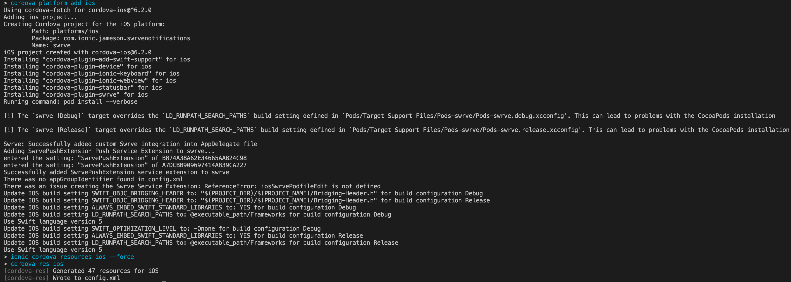
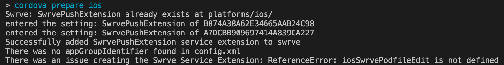
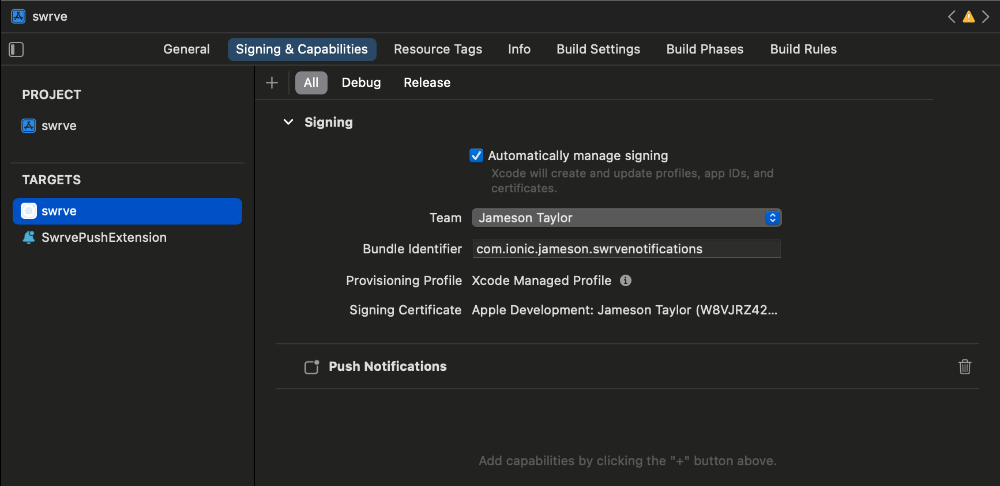
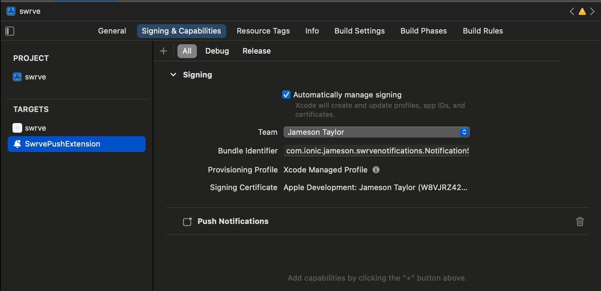
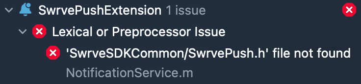
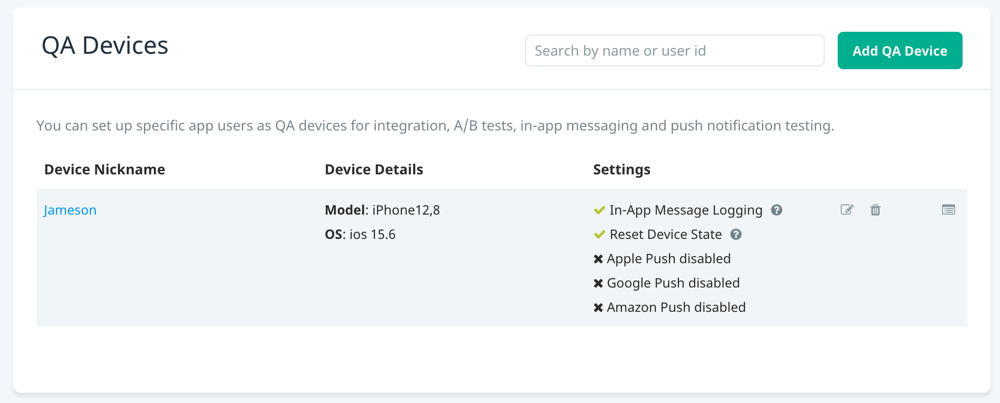
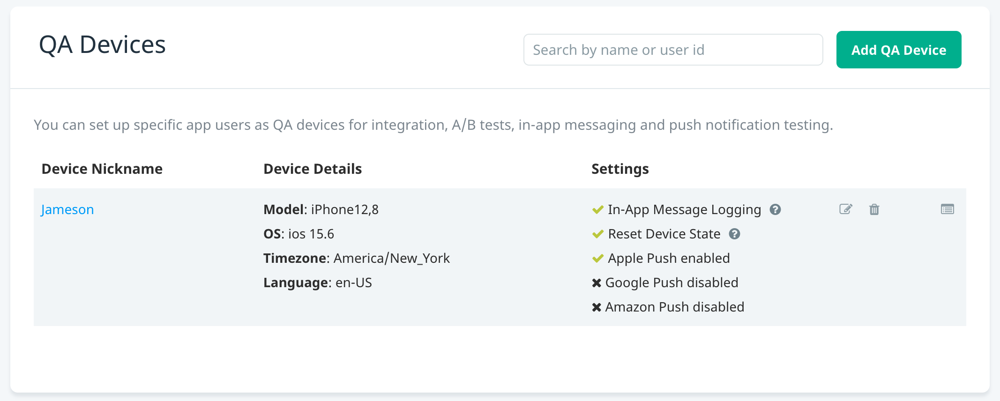
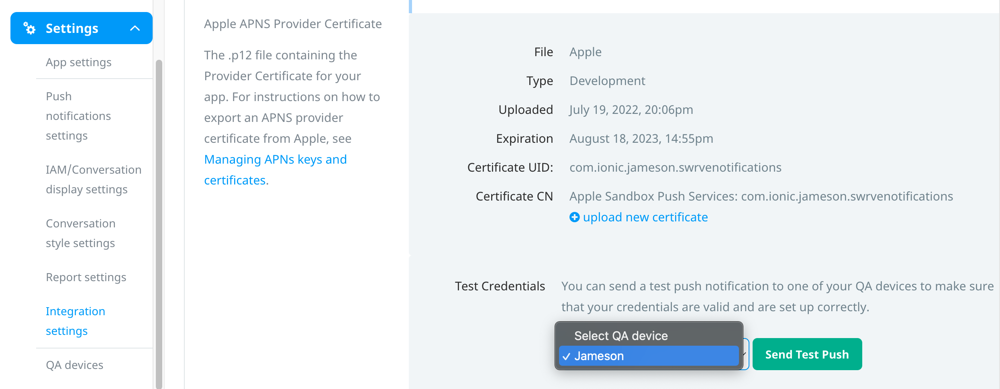

# Ionic + Swrve Push Notifications
This application was created in coordination with Telefonica to try and resolve an issue with Push Notifications sent from Swrve not being received by QA devices correctly.
Originally it seemed to be related to the Ionic product, Auth Connect, but after further investigation it appears in a blank Ionic/Cordova application with _only_ the Swrve plugin installed.
There is an outstanding [issue](https://github.com/Swrve/swrve-cordova-sdk/issues/16) on their github that describes the observed behavior.

# Developer Setup
This app is configured to use a sandbox Swrve account that was setup for Ionic to use for testing. We have been using a personal Apple Developer account for certificate signing, which other developers obviously will not have access to.

Because of this, you'll need to modify the `swrve.appId` and `swrve.apiKey` entries in `config.xml` to be appropriate for the Swrve account you will use to test Push Notifications.

## Installation
### Add iOS Platform
After configuring `config.xml` with your Swrve values add the iOS platform.

```bash
ionic cordova platform add ios
```

At this point there is some CLI output that might point to an issue with the Swrve plugin.
The first message was related to `appGroupIdentifier`, which was originally included during previous tests but seemed [optional](https://docs.swrve.com/developer-documentation/integration/ios/#Add_an_app_group_to_your_service_extension) and removing it appeared to have no effect on the issue (now removed to simplify configuration).
>There was no appGroupIdentifier found in config.xml

There was another message, which seems like an issue but doesn't appear to prevent the app from building.
>There was an issue creating the Swrve Service Extension: ReferenceError: iosSwrvePodfileEdit is not defined

We've also added an entry to `config.xml` to specify the version of Swift (v5).
In previous testing it appeared the Ionic Auth Connect product was setting it to version 4, and this was originally thought to resolve the issue with Push Notifications since the Swrve SDK [requires version 5](https://github.com/Swrve/swrve-ios-sdk/blob/release-7_5_2/Package.swift#L46).
Testing this sample app with _only_ the Swrve plugin installed has disproven that.

See the full CLI output from this command on my machine below:
<div>
  
</div>

### Prepare iOS
Before opening the `swrve.xcworkspace` file, prepare the iOS platform:

```bash
ionic cordova prepare ios
```

This does a build of the web assets, and the messages from above are repeated in the CLI output.
<div>
  
</div>

### Deploy App from Xcode
Open `platforms/ios/swrve.xcworkspace` in Xcode to deploy to your device.
For whatever reason the "Automatically manage signing" setting in Xcode detects some conflicts, but I've found that unchecking it, re-checking it, and _then_ selecting the "Team" you want seems to work fine.

Add the Push Notification capability to the main "swrve" and "SwrvePushExtension" targets.
When you're finished it should similar to the following screenshots:
<div>
  
</div>
<div>
  
</div>

At this point you can deploy to your connected device.
For me Xcode failed to build with the following error (Swrve [documenation](https://docs.swrve.com/developer-documentation/integration/cordova/#Push_notifications) says this might be a possibility):
<div>
  
</div>

Running the following command in the `platforms/ios` directory should resolve this error:
```bash
cd platforms/ios
pod install

# For Apple Silicon Computers
# https://capacitorjs.com/docs/ios/troubleshooting#apple-silicon-ffi-bus-error
# arch -x86_64 pod install
```

**I found that _sometimes_ this broke the signing configuration in Xcode, so needed to uncheck/re-check the "Automatically manage signing" option for the `SwrvePushExtension` target again before attempting to build.**

### Swrve QA Device
Once the app is deployed to your device and is open, visit your Swrve account and navigate to the app dashboard.
You must have already [generated and uploaded](https://docs.swrve.com/developer-documentation/integration-resources/manage-apns-keys-and-certificates/#Using_a_TLS_certificate_p12_file) a `.p12` certificate to enable Push Notifications.
Navigate to the `Settings/QA devices` area of the dashboard and click "Add QA Device", which will show a list of recently detected devices.
Select your device, add it, and then refresh the page.
This is what I saw initially, which indicated Push Notifications were not enabled:
<div>
  
</div>

I found that after adding my device in the Swrve dashboard I had to background the app for around ~10s, resume it, and then refresh the Swrve page before it said they were enabled:
<div>
  
</div>

You are now ready to test Push Notifications.

# Push Notifications
This is where the struggle begins.
_Sometimes_ after deploying the application and ensuring the QA device is registered correctly in Swrve, Push Noticiations get delivered fine (and continue to work while app is installed).
Other times this first installation doesn't work at all.
I've found that uninstalling the app, then re-deploying from Xcode a second time seems to have a much higher chance of not receiving notifications.

Regardless of this, here are the steps to follow for sending a test notification.

Navigate to the `Settings/Integration settings` area of the Swrve dashboard.
Scroll down to the APNS section, and after setting up your device you should be able to select it and send a test notification.
<div>
  
</div>

This should say something like "Your certificate is working!", but if you don't receive it then you will likely see the behavior shown in this screeshare:

<div>
  
</div>

As you can see in the video above, the notification was not received by the device when I sent it from the Swrve dashboard.
I waited for 60s, and then uninstalled the application, at which point in time the "missing" notification was unexpectedly delivered.
This is similar behavior as described in this open [issue](https://github.com/Swrve/swrve-cordova-sdk/issues/16).